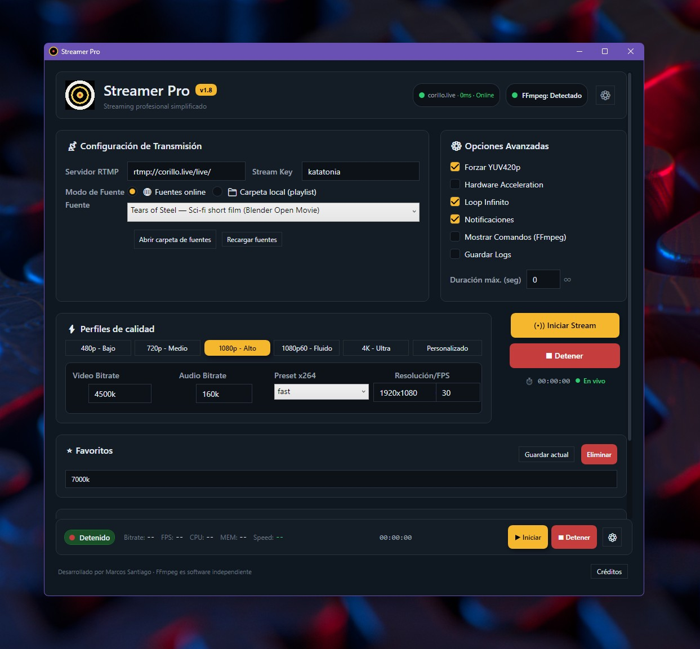

<p align="center">
  
</p>

# Streamer Pro

**Streaming profesional simplificado**

Aplicacion de escritorio premium para Windows que facilita la transmision de video en vivo usando FFmpeg como motor de codificacion.

---

## Que es Streamer Pro?

Streamer Pro es una herramienta de escritorio WPF para hacer streaming de video de forma sencilla y profesional. Permite transmitir desde fuentes online (URLs) o desde carpetas locales como playlist, directamente a servidores RTMP como Corillo.live, Twitch, YouTube Live, y cualquier servidor compatible.

---

## Screenshot

<p align="center">
  
</p>

---

## Funciones Principales

### Transmision en Vivo
- **Streaming a servidores RTMP** - Transmite a cualquier servidor RTMP configurando la URL base y tu Stream Key.
- **Fuentes online** - Reproduce directamente desde URLs de video (HLS, RTMP, archivos remotos).
- **Carpeta local (playlist)** - Selecciona una carpeta con archivos de video y transmitelos como playlist continua.
- **Loop y randomize** - Repite la playlist indefinidamente o reproduce en orden aleatorio.

### Perfiles de Calidad

Selecciona rapidamente entre perfiles predefinidos o configura manualmente:

- **480p Bajo** - 1000k, 854x480
- **720p Medio** - 2500k, 1280x720
- **1080p Alto** - 4500k, 1920x1080
- **1080p60 Fluido** - 5000k, 1920x1080 a 60fps
- **4K Ultra** - 16000k, 3840x2160
- **Personalizado** - Video Bitrate, Audio Bitrate, Preset x264, Resolucion y FPS manuales

### Opciones Avanzadas
- **Forzar YUV420p** - Compatibilidad maxima con reproductores y plataformas
- **Hardware Acceleration** - Aceleracion por hardware cuando este disponible
- **Loop Infinito** - Mantiene la transmision activa indefinidamente
- **Notificaciones** - Alertas del sistema al iniciar o detener transmisiones
- **Mostrar Comandos FFmpeg** - Visualiza el comando exacto que se ejecuta
- **Guardar Logs** - Registra eventos y errores en %AppData%/CorilloStreamer/streamer.log
- **Duracion maxima** - Establece un limite de tiempo para la transmision (0 = infinito)

### Monitoreo en Tiempo Real
- **Status bar profesional** - Indicador de estado (Transmitiendo o Detenido) con pill verde o rojo
- **Metricas en vivo** - Bitrate, FPS, CPU, MEM y Speed actualizados en tiempo real
- **Temporizador de stream** - Tiempo transcurrido desde el inicio de la transmision
- **Estado del servidor** - Verificacion de conectividad y latencia del servidor RTMP
- **Deteccion de FFmpeg** - Indicador visual del estado de FFmpeg

### Favoritos y Historial
- **Guardar perfiles favoritos** - Guarda configuraciones completas para reutilizarlas rapidamente
- **Historial de streams** - Registro de las ultimas transmisiones realizadas

### Experiencia de Usuario
- **Interfaz dark premium** - Diseno oscuro profesional tipo dashboard con acentos amarillo y dorado
- **Minimizar a bandeja** - La aplicacion puede minimizarse al system tray
- **Cifrado de Stream Key** - Las claves se almacenan cifradas con DPAPI
- **Validacion de fuentes** - Las fuentes online se validan automaticamente con FFprobe
- **Manejo robusto de procesos** - Job objects para evitar procesos FFmpeg huerfanos

---

## Requisitos

- **Sistema Operativo:** Windows 10 o 11 (x64)
- **Runtime:** .NET 8 Windows Desktop Runtime
- **FFmpeg:** ffmpeg.exe y ffprobe.exe en el mismo directorio del ejecutable o en PATH

Descargar .NET 8 Runtime: https://dotnet.microsoft.com/en-us/download/dotnet/8.0/runtime

### Obtener FFmpeg

- Sitio oficial: https://ffmpeg.org/download.html
- Gyan (builds estables): https://www.gyan.dev/ffmpeg/builds/
- BtbN (builds automaticos): https://github.com/BtbN/FFmpeg-Builds/releases

---

## Instalacion

1. Descarga la ultima Release desde https://github.com/marcosstgo/Streamer/releases o clona el repositorio
2. Asegurate de tener el .NET 8 Windows Desktop Runtime instalado
3. Coloca ffmpeg.exe y ffprobe.exe en el mismo directorio que el ejecutable
4. Ejecuta Streamer Pro.exe

### Compilar desde codigo fuente

```
git clone https://github.com/marcosstgo/Streamer.git
cd Streamer
dotnet build -c Release
```

---

## Uso Rapido

1. **Configura el servidor** - Ingresa la URL RTMP base y tu Stream Key
2. **Selecciona una fuente** - Elige una fuente online del dropdown o selecciona una carpeta local
3. **Elige un perfil** - Selecciona un perfil de calidad (480p a 4K) o personaliza los parametros
4. **Inicia el stream** - Presiona el boton Iniciar Stream
5. **Monitorea** - Observa las metricas en tiempo real en la barra inferior

---

## Estructura del Proyecto

```
Streamer/
  Streamer/
    App.xaml                  - Recursos globales, paleta, estilos
    MainWindow.xaml           - Interfaz principal
    MainWindow.xaml.cs        - Logica principal
    CreditsWindow.xaml        - Ventana de creditos
    CreditsWindow.xaml.cs     - Logica de creditos
    Models/                   - Modelos de datos (Source, etc.)
    Services/                 - Servicios (FFmpeg, validacion)
    Streamer.csproj           - Proyecto .NET 8 WPF
    streamerpro.png           - Icono de la aplicacion
    streamer.ico              - Icono del ejecutable
  README.md
  CHANGELOG.md
  CONTRIBUTING.md
  LICENSE-FFMPEG.txt
  docs/
    screenshot.png            - Screenshot de la aplicacion
```

---

## Stack Tecnologico

- **.NET 8** - Framework principal
- **WPF** - Interfaz de usuario
- **FFmpeg** - Motor de codificacion y transmision
- **FFprobe** - Validacion de fuentes de video
- **DPAPI** - Cifrado seguro de Stream Key
- **C#** - Lenguaje de programacion

---

## Verificacion de Binarios FFmpeg

```
Get-FileHash -Algorithm SHA256 .\ffmpeg.exe
Get-FileHash -Algorithm SHA256 .\ffprobe.exe
```

Checksums esperados (v7.1):
- ffmpeg.exe: 5AF82A0D4FE2B9EAE211B967332EA97EDFC51C6B328CA35B827E73EAC560DC0D
- ffprobe.exe: 192A1D6899059765AC8C39764FC3148D4E6049955956DC2029F81F4BD6A8972D

---

## Licencia

Este proyecto es software propietario desarrollado por **Marcos Santiago**.

FFmpeg es software independiente con su propia licencia. Consulta LICENSE-FFMPEG.txt para mas detalles.

---

## Creditos

- **Desarrollado por** - Marcos Santiago
- **Asistencia de IA** - GitHub Copilot y ChatGPT
- **Motor de streaming** - FFmpeg (https://ffmpeg.org/)

---

Hecho con amor en Puerto Rico